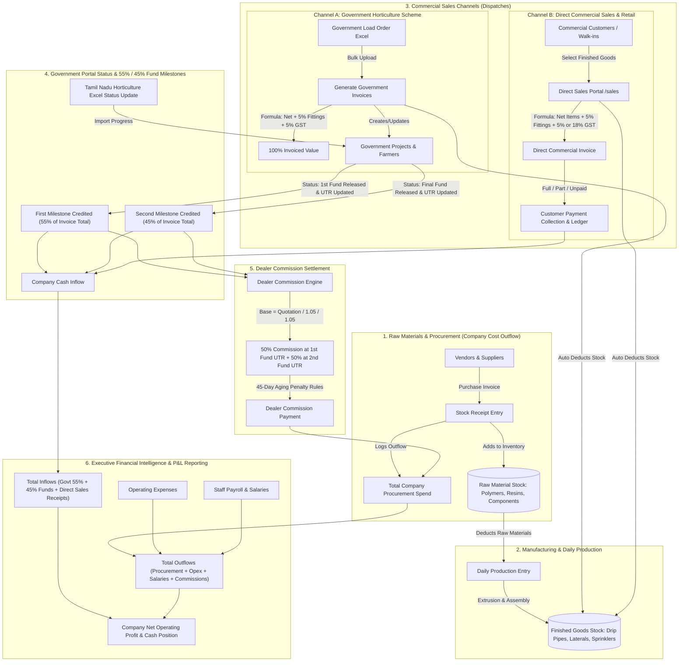

# Cheran ERP — End-to-End Business Workflow Guide

This document explains the complete, real-world lifecycle of Cheran Irrigation ERP in simple English, from raw materials purchase to manufacturing, government project execution, direct commercial sales, invoice generation, fund milestone releases, dealer commissions, and executive financial reporting.

---

## 🗺️ Master App Flowchart Diagram

---

## 📋 Step-by-Step Workflow Explained in Simple English

---

### Step 1: Raw Materials & Purchasing (Cost Outflow)
* **What happens**: The company purchases raw materials (such as polymer granules, masterbatches, dripper inserts, coils, packaging) from suppliers/vendors.
* **In the ERP**:
  1. Staff records a **Purchase Receipt** under `Inventory & Materials -> Purchase Receipts`.
  2. The system increments the on-hand stock of raw materials.
  3. The purchase invoice total is logged as a **Direct Procurement Cost** to the company.

---

### Step 2: Daily Production & Manufacturing
* **What happens**: The factory uses raw materials to manufacture finished goods (drip pipes, lateral tubes, micro-sprinklers).
* **In the ERP**:
  1. Under `Daily Production`, staff logs the raw materials consumed and finished goods produced.
  2. Raw material stock is atomically deducted, and finished goods stock is increased.

---

### Step 3: Sales Channels & Dispatches (Stock Deductions)

Cheran ERP supports **two distinct sales channels**:

#### Channel A: Government Horticulture Schemes & Load Orders
1. Staff uploads the **Load Order Excel** at `/imports/load-order`.
2. The ERP generates official invoices for all listed Government Application IDs.
3. **Calculation Formula**:
   $$\text{Net Items} + \text{5\% Fittings Cost} + \text{5\% GST} = \text{100\% Total Invoiced Amount}$$
4. Finished goods stock is atomically deducted upon dispatch.

#### Channel B: Direct Commercial Sales (`/sales`)
1. Staff opens `/sales` and clicks **New Direct Sale**.
2. Selects an existing customer or types a walk-in customer name.
3. The system auto-loads all **Finished Goods items** with current stock availability and standard unit prices.
4. Staff enters dispatch quantities for the selected items.
5. **Commercial Calculation**:
   - $\text{Net Items Total} = \sum (\text{Quantity} \times \text{Unit Price})$
   - $\text{Fittings (5\%)} = \text{Net Items Total} \times 0.05$
   - $\text{Taxable Subtotal} = \text{Net Items Total} + \text{Fittings}$
   - **GST Rate Selector**: User chooses **5% (Drip/Agri)** or **18% (Commercial/Pipes)**
   - $\text{Grand Total} = \text{Taxable Subtotal} + \text{GST Amount}$
6. Upon saving, finished goods stock is reduced and the invoice is created.
7. Staff can record immediate or installment payments (**Paid, Partial, or Unpaid**).

---

### Step 4: Government Status Updates & 55% / 45% Fund Inflow
* **What happens**: As the government horticulture department processes the files, funds are released in two bank transfers (UTRs):
  - **Milestone 1 (1st Fund Release)**: **55% of the Total Invoiced Amount** is credited into company bank account when 1st Fund UTR is updated.
  - **Milestone 2 (2nd / Final Fund Release)**: The remaining **45% of Total Invoiced Amount** is credited when Final Fund UTR is updated.
* **In the ERP**:
  1. Uploading the government status Excel updates the project lifecycle and timestamps UTR numbers and dates.
  2. The system tracks:
     - Total Invoiced Value ($100\%$)
     - Received 1st Fund ($55\%$)
     - Received 2nd Fund ($45\%$)
     - Outstanding Subsidy Pending from Government.

---

### Step 5: Dealer Commission Settlement
* **What happens**: Local agricultural dealers who onboarded the farmers are entitled to a commission percentage.
* **In the ERP**:
  - The commission base is the Net Subsidy Amount (deducting the 5% fittings and 5% GST):
    $$\text{Commission Base} = \frac{\text{Quotation / Invoice Amount}}{1.05 \times 1.05}$$
  - **50% of dealer commission** is unlocked upon 1st Fund UTR.
  - **Remaining 50%** is unlocked upon 2nd Fund UTR.
  - Penalties apply if completion takes longer than 45 days.

---

### Step 6: Reports & Company Financial Intelligence (`/reports`)
The `/reports` module combines all operational threads to show the real financial health of Cheran:

1. **Company Cash Inflows**:
   - Government 1st Fund credits ($55\%$)
   - Government 2nd Fund credits ($45\%$)
   - Direct commercial sales customer collections
2. **Company Cash Outflows**:
   - Raw material & component purchase bills
   - Operating expenses (rent, electricity, transport, fuel)
   - Staff payroll and attendance payouts
   - Dealer commissions paid
3. **Net Business Performance**:
   $$\text{Net Operating Cash Position} = \text{Total Cash Inflow} - \text{Total Cash Outflow}$$
